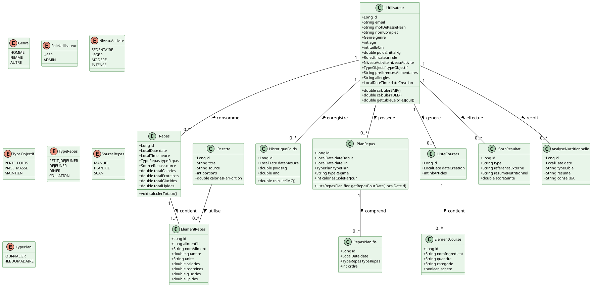
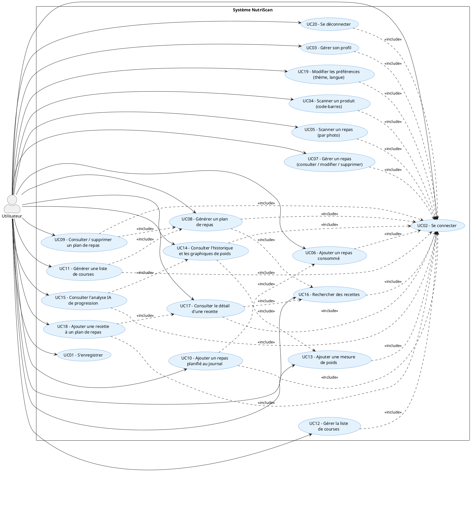
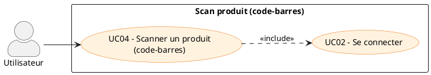

# Diagrammes UML NutriScan (PlantUML)

Ce document regroupe les principaux diagrammes UML du projet NutriScan au **format PlantUML**, prêts à être copiés dans un outil comme PlantUML, IntelliJ, VS Code, etc.

---

## 1. Diagramme de classes principal (backend métier)

---

## 2. Diagramme de cas d’utilisation global

---

## 3. Diagramme de cas d’utilisation détaillé – Scan produit (exemple)

---

Ces snippets PlantUML peuvent être copiés directement dans n'importe quel éditeur compatible, ou dans un bloc `@startuml` / `@enduml` dans votre IDE pour générer les diagrammes graphiques.

